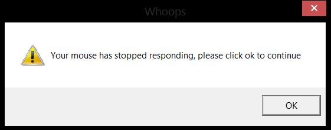
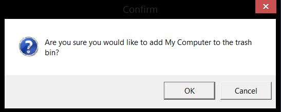
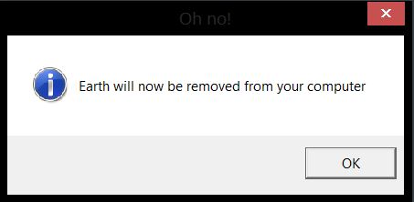

<h1 align="center"> Doodle </h1>
<p align="center"> 💾 Some hilarious windows error popups </p>
<p align="center">
  <a href="http://vutondesign.com/MyMIT"></a>
</p>

### Installation
##### Method one - git clone:
```
git clone https://github.com/ktrvs/doodle.git
```

##### Method two - copying the code:
You can copy the code into a blank text document and then save it with a ``.vbs`` file extension instead of a ``.txt`` extension.

### Usage 
Simply click on the ``.vbs`` file to launch the error message, it's that easy! Please note that these are fake and have no control over anything on your computer.

----

### Examples 

##### broken-mouse.vbs


##### confirm-delete.vbs


##### earth-remove.vbs


----

### License 
🎨 with ❤️ by ktrvs under the [MIT License](http://ktrvs.com/MyMIT/).


